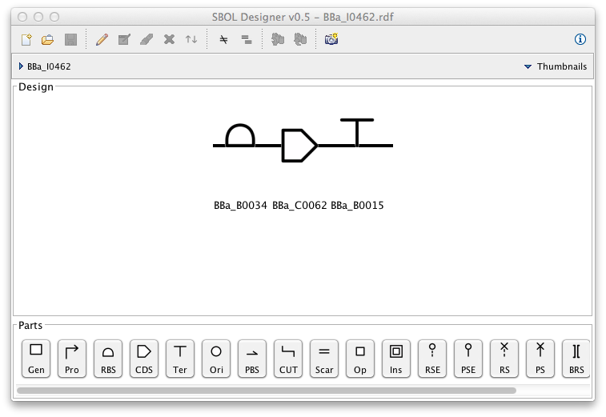
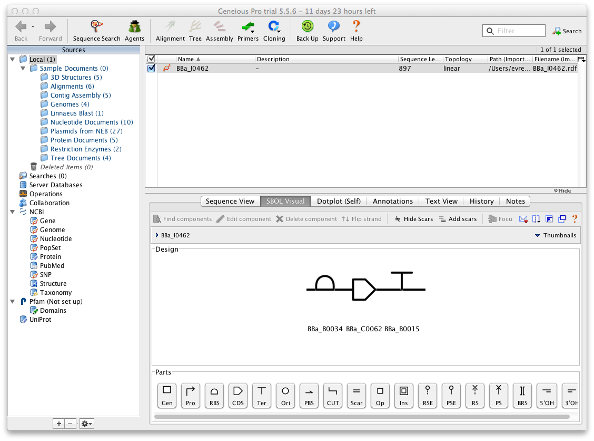

SBOL Designer is a synthetic biology design tool for creating and visualizing designs expressed using 
[Synthetic Biology Open Language (SBOL)](http://www.sbolstandard.org/). SBOL is an open-source data exchange 
standard for descriptions of genetic parts, devices, modules, and systems. SBOL defines both a serialization 
format based on RDF/XML and a set of visual icons to graphically depict functional information encoded by 
nucleic acid sequences.

SBOL Designer allows users to create designs using SBOL visual icons, edit SBOL designs in a GUI, save 
designd in an SBOL RDF/XML file, and import DNA components from an SBOL parts registry. SBOL Designer 
uses [Standard Biological Parts Knowledgebase (SBPkb)](https://sites.google.com/a/sbolstandard.org/sbol/libsbol/sbpkb)
to import DNA components from the [Registry of Standard Biological Parts](http://partsregistry.org/) at MIT.
Other SPARQL endpoints can be defined in the tool to use components from a different source.

SBOL Designer can be used either as a standalone program or a as a [Geneious](http://www.geneious.com/) plugin.

## Quick tutorial

Watch the following screencast for a quick overview of the SBOL designer features (no audio required).

<iframe width="560" height="315" src="http://www.youtube.com/embed/fHZw-PDG_R0" frameborder="0" allowfullscreen></iframe>

## Running SBOL Designer

SBOL designer requires Java 6 or later to be installed on your computer. To run SBOL designer, 
simply double click the jar file. If your OS does not support running Java applications by
double clicking, you can run the designer from command-line by using the `java -jar <jarFileName>`
command at a terminal where `jarFileName` will be the name of the SBOL Designer jar file you
downloaded.

 
## Installing SBOL Designer plugin for Geneious

[Geneious](http://www.geneious.com/) is a very popular DNA, RNA and protein sequence alignment, assembly and analysis 
software platform, integrating bioinformatic and molecular biology tools into a simple interface. SBOL
designer can be used as a Geneious plugin that allows users to visualize the sequences created in Geneious
using SBOL visual icons, edit the design using the SBOL view, and see the results immediately inside
Geneious.

SBOL Designer plugin has been tested with Geneious 5.5 and later. To install the plugin, start
Geneious, go to Tools->Plugins menu option, click "Install plugin from a gplugin file" and select 
the SBOL designer gplugin file. The plugin will be ready to use immediately.

If you download a newer version of the plugin at a later time you can follow the same steps and
the new version of the plugin will replace the old version.

## License

SBOL Designer is currently available as closed-source software but can be used free of charge accrding to its
[license](https://github.com/clarkparsia/sbol/blob/master/LICENSE.txt).  

## Acknowledgements

SBOL designer is developed by [Clark & Parsia, LLC](http://clarkparsia.com) in conjunction 
with [University of Washington](http://www.washington.edu). Special thanks to 
[John Gennari](http://faculty.washington.edu/gennari/), [Michal Galdzicki](http://faculty.washington.edu/mgaldzic/),
[Herbert Sauro](http://depts.washington.edu/bioe/people/core/sauro.html), and Bryan Bartley.
This work was in part funded by NIH grant #9R42HG006737.

